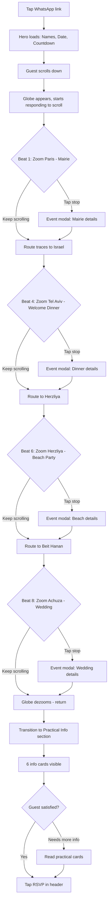
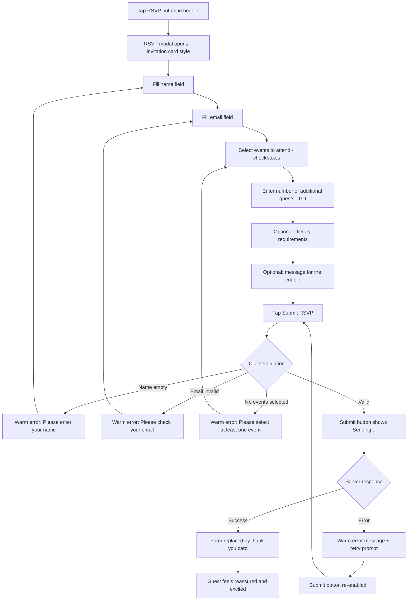
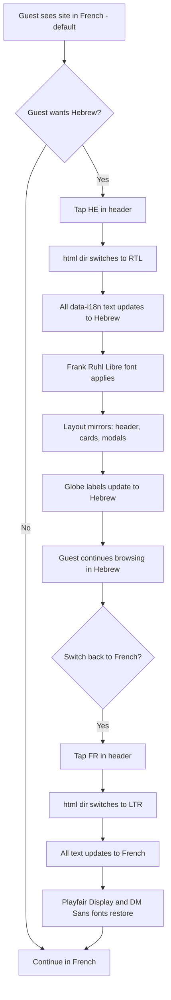

# UX Design Specification sitemariage

**Author:** Eric
**Date:** 2026-02-19

---

## Executive Summary

### Project Vision

A mobile-first, single-page wedding website that transforms guest communication into an emotional storytelling experience. The site guides guests on a visual journey from Paris to Tel Aviv through an animated scroll path, revealing three celebration events along the way. Built with an elegant autumnal palette (terracotta, olive, warm cream) and refined typography, it balances warmth and sophistication. Bilingual support (French default, Hebrew with RTL) ensures every guest feels welcomed in their language.

### Target Users

**Primary audience:** Wedding guests of Anael & Eric, spanning a wide age range (20s to 70s+), including:
- **French-speaking guests** (family and friends from France) -- the primary audience, hence French as default
- **Hebrew-speaking guests** (Israeli family/friends) -- requiring full RTL support and Hebrew-native typography

**Access pattern:** Predominantly mobile via WhatsApp-shared links. Guests will receive the URL in a message, tap it, and experience the site on their phones. Desktop is secondary.

**Tech comfort:** Varies widely. Younger guests will intuitively scroll through animations; older guests need clear affordances, large touch targets (44px+), readable fonts, and graceful fallbacks for reduced-motion preferences.

### Key Design Challenges

1. **Cross-generational accessibility** -- The scroll-driven animation must be intuitive for guests in their 70s while still feeling engaging for younger users. This means generous touch targets, readable font sizes, clear visual hierarchy, and a prefers-reduced-motion fallback that still tells the story.
2. **Bilingual RTL complexity** -- Hebrew requires a full layout mirror. The travel path, header, modals, form, and practical info cards must all feel spatially natural in RTL. Hebrew typography (Frank Ruhl Libre) has different rhythm than Latin fonts, requiring careful spacing and sizing.
3. **Mobile scroll animation fidelity** -- The globe/map journey section is the signature feature but the highest-risk UX element on mobile. Must feel buttery smooth on older devices.
4. **Single-page information density** -- Four events, six practical info cards, and an RSVP form must flow naturally without overwhelming the user. The journey metaphor helps sequence the content, but pacing and whitespace are critical.

### Design Opportunities

1. **Narrative scroll experience** -- The Paris-to-Israel travel path transforms a functional wedding site into a story. Each scroll segment builds anticipation, each stop reveals a celebration. This emotional journey is the site's differentiator.
2. **Warmth through visual design** -- The autumnal palette (terracotta, olive, warm cream) with Cormorant Garamond creates an atmosphere of refined intimacy -- like receiving a hand-crafted invitation. Whitespace and typography can elevate the experience beyond typical wedding websites.
3. **Hospitality through practical info** -- For guests traveling internationally, well-organized logistics (flights, hotels, transport, currency, emergency numbers) demonstrates care and reduces travel anxiety -- turning information into an act of hospitality.

## Core User Experience

### Defining Experience

The site is already built and functional as a scroll-driven narrative journey. The core experience flows: Hero (names, date, countdown) -> Scroll through a travel animation (Paris to Israel) -> Tap event stops for modal details -> Continue to practical info cards -> RSVP via persistent header button.

**What's working well:**
- The GSAP scroll-triggered traveler on the snake path is the signature differentiator
- Event modals have good accessibility (focus management, keyboard support, aria attributes)
- The autumnal palette (terracotta, olive, cream, gold) is cohesive and warm
- The countdown timer (months + days) adds urgency and excitement
- Hebrew RTL switching works with Frank Ruhl Libre typography

**What needs UX improvement:**
- RSVP submission is non-functional (GAS URL is placeholder)
- Traveler emoji icon mapping may not match event semantics logically
- Some data-i18n elements lack French defaults (practical info cards, RSVP labels) -- causing content flash
- Footer text is hardcoded in French with no i18n
- SVG assets (logo, transport icons) exist but are unused -- site uses PNG logo and emoji instead
- No prefers-reduced-motion handling for the GSAP scroll animation
- Google Fonts loaded twice (HTML link + CSS import)
- Overall visual polish, component quality, and code organization need professional upgrade

### Platform Strategy

- **Platform:** Mobile web, single-page static site (migrating to Astro + React islands)
- **Primary input:** Touch (phone screens, WhatsApp-shared links)
- **Current state:** Deployed and functional for FR/HE, RSVP UI-only
- **Key constraint:** No backend -- RSVP relies on Google Apps Script (not yet configured)
- **Performance consideration:** Globe/map journey section must be smooth on mid-range mobile devices

### Effortless Interactions

| Interaction | Current State | Improvement Target |
|---|---|---|
| Scroll journey | Working -- emoji traveler follows snake path | Replace with globe/map zoom journey; add reduced-motion fallback |
| Event details | Working -- modals with good a11y | Upgrade to shadcn/ui Dialog; ensure all events have confirmed times |
| RSVP | UI working, submission broken | Configure GAS URL; upgrade form with shadcn/ui components |
| Language switch | FR/HE working | Maintain bilingual FR/HE with professional implementation |
| Practical info | Working via i18n | Render as static Astro HTML to prevent flash of empty cards |

### Critical Success Moments

1. **The "wow" scroll** -- When the globe starts rotating and zooming into the first venue. This is the new signature moment.
2. **The "I get it" tap** -- When a guest taps a stop on the zoomed map and the modal shows date/location/transport/dresscode.
3. **The "done" RSVP** -- When a guest submits and sees confirmation. Currently broken -- highest-priority fix.
4. **The "helpful" info** -- When guests find practical travel cards.

### Experience Principles

1. **Journey First** -- The globe/map animation is the defining experience. Make the geographic journey feel real and exciting.
2. **Effortless Action** -- RSVP must work end-to-end. Configure the GAS endpoint and test the full flow.
3. **Instant Clarity** -- Pre-populate French defaults everywhere to eliminate content flash. Every tap should reveal info instantly.
4. **Graceful for Everyone** -- Add prefers-reduced-motion fallback (static map), ensure generous touch targets for older guests.

## Desired Emotional Response

### Primary Emotional Goals

- **Awe and excitement** at first landing -- the visual design and animation quality should signal "this is going to be something special"
- **Adventure and discovery** during the scroll journey -- each scroll segment reveals more of the Paris-to-Israel story, creating a sense of shared voyage
- **Reassurance and warmth** after RSVP -- guests feel officially part of the celebration and confident that everything is organized

### Emotional Journey Mapping

| Stage | Desired Emotion | Current State | Improvement Opportunity |
|---|---|---|---|
| First landing (Hero) | Awe, excitement | Strong -- autumnal palette, countdown, elegant typography | Ensure no content flash breaks the initial impression |
| Scroll journey | Adventure, discovery | Working -- emoji traveler on snake path is engaging | Replace with globe zoom/travel/zoom cycle for geographic realism |
| Event stop tap | Excitement, clarity | Good -- modals open smoothly with clear info | Upgrade to shadcn/ui Dialog; add confirmed event times |
| RSVP submission | Reassurance, warmth | Broken -- GAS URL is placeholder | Critical fix: enable end-to-end submission |
| Post-RSVP | Confidence, belonging | Partially working -- success message exists | Ensure thank-you message feels personal, not generic |
| Practical info | Confidence, relief | Working -- 6 cards with detailed info | Render as static HTML to prevent empty card flash |
| Error states | Calm, reassured | RSVP error state exists | Ensure error messages are warm, not technical |

### Micro-Emotions

**Critical micro-emotions to design for:**
- **Trust** -- RSVP must submit successfully and confirm clearly. Any failure undermines trust in the entire site.
- **Excitement over anxiety** -- The international travel aspect could trigger logistics anxiety. Practical info cards must preemptively answer: "How do I get there? Where do I stay? What's the currency?"
- **Belonging** -- Every guest must feel included in their language (French or Hebrew).
- **Confidence over confusion** -- Event details must be complete (times, locations, dress codes). "A confirmer" placeholders create uncertainty.

### Design Implications

| Emotional Goal | UX Design Approach |
|---|---|
| Awe at landing | Rich hero with smooth countdown animation, no content flash, elegant Cormorant Garamond at clamp(2.5rem, 8vw, 5rem), warm radial gradient background |
| Adventure during scroll | Globe/map zoom journey with Indiana Jones route line; each zoom-in feels like arriving somewhere new |
| Reassurance at RSVP | Immediate, warm confirmation message; clear form validation with friendly (not red/alarming) error states; disable submit during processing to prevent double-tap anxiety |
| Warmth throughout | Terracotta and cream palette, generous whitespace, Cormorant Garamond headings, personal touches (olive tree logo, couple names prominent) |
| Confidence in logistics | Complete, accurate practical info; all event times confirmed; bilingual coverage |

### Emotional Design Principles

1. **Beauty Builds Trust** -- The visual quality of the site signals care and preparation. If the site is beautiful, guests trust the wedding will be too.
2. **Discovery Over Information Dump** -- Reveal details through the journey, not all at once. The scroll experience should feel like unwrapping, not reading a brochure.
3. **Warm Error Handling** -- When things go wrong (network errors, validation), the tone should be warm and reassuring, not clinical. "Something went wrong" should feel like a friend apologizing, not a system error.
4. **Completeness Builds Confidence** -- Every "A confirmer" placeholder and every content flash erodes confidence. Complete information = calm guests.

## UX Pattern Analysis & Inspiration

### Inspiring Products Analysis

**1. Google Language Explorer (sites.research.google/languages/language-explorer)**
- **What inspires:** Interactive globe that zooms into specific locations, creating spatial storytelling through geographic movement
- **Key UX pattern:** Geography as narrative device -- the map/globe IS the story
- **Relevance to sitemariage:** The journey from Paris to Israel is inherently geographic. A globe/map visualization with scroll-driven zoom-in/dezoom/travel cycles would make the journey tangible and exciting
- **Desired adaptation:** A lightweight globe or map that zooms into each venue location on scroll, dezooms to show the route traveling, then zooms into the next stop -- with Indiana Jones-style route lines and emoji markers

**2. Apple Product Pages (apple.com/iphone, apple.com/macbook)**
- **What inspires:** Gold standard of scroll-driven storytelling; one clear message per scroll segment; elements animate precisely as you reach them
- **Key UX pattern:** Scroll pacing -- each scroll beat has exactly one revelation
- **Relevance to sitemariage:** Each zoom-in on a venue should be a distinct "moment." Zoom -> reveal stop with emoji and label -> hold for tap interaction -> dezoom -> travel to next stop.

**3. Stripe Homepage (stripe.com)**
- **What inspires:** Premium feel through subtle motion and generous whitespace; typography hierarchy that guides attention
- **Key UX pattern:** Restraint in animation -- motion enhances understanding, never distracts
- **Relevance to sitemariage:** The globe/map should feel elegant and spacious. The route line draws itself smoothly. Transitions between zoom levels should be buttery, not jarring.

**4. Airbnb Listing Pages (airbnb.com)**
- **What inspires:** Excellent information density management; complex info through progressive disclosure; clean modal design
- **Key UX pattern:** Progressive disclosure -- overview first, details on interaction
- **Relevance to sitemariage:** Globe shows the geographic overview. Zoomed-in view shows stop name/emoji. Tap opens modal with full event details. Three levels of disclosure: globe -> zoomed stop -> modal detail.

### Transferable UX Patterns

**Globe/Map Journey Pattern (Signature Feature):**
- **Scroll-driven globe with zoom/dezoom/travel cycle** -- The primary journey experience uses a lightweight globe or map visualization. As the user scrolls:
  1. Globe shows France highlighted -> zoom into Paris (Mairie stop with emoji)
  2. Dezoom -> Indiana Jones dashed route line traces across Mediterranean
  3. Zoom into Tel Aviv area (Welcome Dinner stop with emoji)
  4. Dezoom -> short route to coast
  5. Zoom into Herzliya (Beach Party stop with emoji)
  6. Dezoom -> route south
  7. Zoom into Beit Hanan (Wedding Ceremony stop with emoji)
  8. Dezoom to full globe -> route traces back (return)
- Each zoom-in is a "moment" where the user can tap to open the event modal
- Route line uses the autumnal color palette (terracotta dashed line on olive/cream globe)
- Performance-first approach: choose the lightest rendering method that achieves the effect

**Technical Approach Options (ranked by performance):**
1. **D3.js orthographic projection** -- SVG-based "fake 3D" globe. Very lightweight, fully styleable with CSS, smooth zoom transitions. Best mobile performance. Recommended starting point.
2. **Globe.gl** -- Lightweight WebGL globe. Real 3D rotation, moderate performance cost. Good middle ground.
3. **Mapbox/MapLibre GL** -- Vector tile map with smooth zoom. Not a globe but excellent zoom transitions. Moderate weight.
4. **Three.js custom globe** -- Full control but heaviest option. Only if simpler options can't achieve the effect.

**Scroll Pacing Pattern (from Apple):**
- **One stop per scroll beat** -- Each zoom-in/dezoom cycle corresponds to one scroll segment. Clear rhythm: dezoom -> travel -> zoom-in -> reveal stop -> interaction opportunity -> dezoom -> travel. Approximately 5-7 beats for the full journey.

**Progressive Disclosure Pattern (from Airbnb):**
- **Three levels:** Globe overview -> zoomed stop with emoji/label -> modal with full event details. Each level reveals more, none overwhelms.

**Premium Motion Pattern (from Stripe):**
- Route line draws itself (SVG stroke-dashoffset or equivalent)
- Zoom transitions are smooth easing curves, not linear
- Stop labels and emoji fade in gently at each zoom-in
- All motion tied to scroll (scrub: true), never auto-playing

### Anti-Patterns to Avoid

1. **Over-engineered 3D** -- Avoid heavy WebGL shaders, detailed earth textures, or complex lighting. The globe should feel like an elegant illustration, not Google Earth.
2. **Fighting scroll speed** -- All globe rotation, zoom, and route animation must follow scroll 1:1 (scrub: true). Any smoothing lag is disorienting on mobile.
3. **Tiny labels on globe** -- When zoomed out, stop labels should be hidden or minimal. When zoomed in, labels must be large and readable (18px+ on mobile).
4. **Complex gestures** -- No pinch-to-zoom, no drag-to-rotate. Scroll only. Older guests should never feel lost.
5. **No fallback** -- Must have a static fallback for prefers-reduced-motion: a styled map with all stops visible and route drawn, no animation.

### Design Inspiration Strategy

**What to Adopt:**
- Globe/map as the journey canvas with scroll-driven zoom cycles (from Language Explorer concept)
- Scroll pacing: one zoom beat per stop (from Apple)
- Three-level progressive disclosure: globe -> zoomed stop -> modal (from Airbnb)
- Premium motion restraint and typography hierarchy (from Stripe)
- Indiana Jones dashed route line as the connecting thread

**What to Adapt:**
- Language Explorer's data-heavy globe -> minimalist autumnal-palette globe showing only the France-to-Israel route
- Apple's product narrative -> wedding journey narrative with emoji markers at each venue
- The current snake path -> geographic globe/map that tells the real story of traveling from Paris to Tel Aviv

**What to Avoid:**
- Heavy textures or Earth imagery (keep it illustrated/minimal)
- Interactive map controls (scroll-only, no gestures)
- Animation lag or smoothing (scrub: true always)
- Information overload on the globe (route + stops + emoji only when zoomed in)

## Design System Foundation

### Design System Choice

**Astro + React Islands + shadcn/ui + Tailwind CSS + D3.js**

A full architecture upgrade from the current vanilla JS implementation to an industry-leading static-first stack:
- **Astro** as the site framework (zero JS for static content, islands for interactivity)
- **React** for interactive islands (globe, modals, RSVP form, language switcher)
- **shadcn/ui** (built on Radix primitives) for accessible, beautiful UI components
- **Tailwind CSS** for utility-first styling with custom autumnal design tokens
- **D3.js** (d3-geo) for the globe/map visualization
- **GSAP + ScrollTrigger** retained for scroll-driven animations

### Rationale for Selection

1. **Performance-first for mobile** -- Astro ships zero JS for static sections (hero, practical info, footer). Only interactive islands (globe, modals, RSVP) include JavaScript. This is the lightest possible bundle for a content-heavy wedding site accessed primarily via mobile WhatsApp links.
2. **Professional component quality** -- shadcn/ui provides production-quality modals, forms, buttons, and dialogs with built-in accessibility (focus trapping, keyboard navigation, screen reader support). Eliminates the amateur feel of custom components.
3. **Industry-standard design tokens** -- Tailwind CSS provides a professional token system for spacing, typography, colors, shadows, and responsive breakpoints. The autumnal palette (terracotta, olive, cream, gold) is configured as custom Tailwind tokens.
4. **Globe/map capability** -- D3.js with d3-geo orthographic projection integrates naturally as a React component, giving the lightweight globe visualization.
5. **Full rewrite safety** -- The current project is preserved on the `main` branch. The new implementation lives on a `v2-astro` branch until Eric approves the migration.

### Implementation Approach

**Architecture:**
```
sitemariage-v2/
├── astro.config.mjs          # Astro config with React integration
├── tailwind.config.js         # Autumnal palette + custom tokens
├── src/
│   ├── layouts/
│   │   └── Layout.astro       # Base HTML layout (lang, dir, fonts, meta)
│   ├── pages/
│   │   └── index.astro        # Single page: static sections + React islands
│   ├── components/
│   │   ├── Hero.astro         # Static (zero JS) -- names, date, countdown
│   │   ├── GlobeJourney.tsx   # React island -- D3.js globe + GSAP scroll
│   │   ├── EventModal.tsx     # React island -- shadcn/ui Dialog
│   │   ├── RsvpModal.tsx      # React island -- shadcn/ui Dialog + Form
│   │   ├── PracticalInfo.astro # Static (zero JS) -- 6 cards
│   │   ├── LangSwitcher.tsx   # React island -- language state management
│   │   └── ui/               # shadcn/ui component copies
│   ├── i18n/
│   │   ├── fr.ts              # French translations
│   │   ├── he.ts              # Hebrew translations
│   │   └── index.ts           # i18n utility functions
│   ├── lib/
│   │   ├── globe.ts           # D3.js globe rendering logic
│   │   └── utils.ts           # shadcn/ui utility (cn function)
│   └── styles/
│       └── globals.css        # Tailwind base + custom styles
├── public/
│   ├── favicon.svg
│   └── fonts/                 # Self-hosted fonts (optional)
```

**Static vs. Interactive Split:**

| Component | Rendering | JS Shipped |
|---|---|---|
| Hero (names, date, location) | Astro (static HTML) | 0 KB |
| Countdown | Astro island (client:load) | ~2 KB |
| Globe Journey | React island (client:visible) | ~80 KB (D3 + React + GSAP) |
| Event Modal | React island (client:idle) | ~15 KB (Radix Dialog) |
| RSVP Modal | React island (client:idle) | ~20 KB (Radix Dialog + Form) |
| Practical Info | Astro (static HTML) | 0 KB |
| Language Switcher | React island (client:load) | ~5 KB |
| Footer | Astro (static HTML) | 0 KB |

**Estimated total JS budget:** ~120 KB (gzip ~40 KB), loaded progressively via islands.

### Customization Strategy

**Tailwind Design Tokens (autumnal palette):**
```javascript
// tailwind.config.js
colors: {
  primary: '#C1513A',     // Terracotta
  accent1: '#E07B39',     // Burnt Orange
  accent2: '#E8B84B',     // Warm Yellow/Gold
  dark: '#3D2314',        // Deep Brown
  light: '#F5ECD7',       // Warm Cream
  olive: '#6B7C45',       // Olive Green
  surface: '#FAF3E8',     // Off-white warm
}
fontFamily: {
  heading: ['Cormorant Garamond', 'serif'],
  body: ['Inter', 'sans-serif'],
  hebrew: ['Frank Ruhl Libre', 'serif'],
}
```

**shadcn/ui Theme Customization:**
- Override shadcn/ui CSS variables with autumnal palette values
- Modal backdrop uses `rgba(61,35,20,0.6)` with `backdrop-filter: blur(6px)`
- Form inputs use olive border, terracotta focus ring
- Buttons use terracotta background with cream text

**RTL Support:**
- Tailwind's `rtl:` variant for directional utilities
- shadcn/ui components respect `dir="rtl"` natively
- Frank Ruhl Libre loaded conditionally for Hebrew via Astro's font optimization

**prefers-reduced-motion:**
- Globe falls back to static illustrated map with all stops visible
- No scroll-triggered animations
- Modals use instant show/hide instead of slide transitions

## Defining Experience

### The Core Interaction

**"Scroll to travel from Paris to Israel on a globe, discovering each wedding event along the way."**

This is sitemariage's one-sentence pitch -- the interaction guests will describe to friends. It combines the familiar "Google Maps zoom" mental model with the iconic "Indiana Jones travel line" metaphor, driven entirely by scroll. Users don't need instructions -- they just scroll, and the story unfolds.

### User Mental Model

**What guests bring to the experience:**
- **Wedding website expectations** -- Typically static pages with event lists and RSVPs. The bar is low, which means even a modest globe animation will exceed expectations.
- **Google Maps familiarity** -- Zoom-in/zoom-out on a map is universally understood. The globe interaction leverages this existing mental model.
- **Indiana Jones visual metaphor** -- The dashed line tracing across a map between locations is an iconic, instantly recognizable cultural reference. Guests will "get it" without explanation.
- **WhatsApp mobile context** -- Guests expect instant loading and vertical scrolling. The globe must load fast and respond to scroll immediately.

**Where guests might get confused:**
- If the globe doesn't respond immediately to scroll (animation lag)
- If event stops aren't clearly tappable (insufficient affordance for older guests)
- If the zoom-in doesn't clearly show which venue/event they're looking at
- If the transition between globe and other page sections feels jarring

### Success Criteria

The core experience succeeds when it is simultaneously:

1. **Smooth and intuitive** -- Just scroll and everything happens naturally. No instructions, no tutorials. 60fps on mid-range mobile devices. Zero jank during zoom transitions.

2. **Beautiful and surprising** -- The visual quality creates a genuine "wow" moment. The autumnal-palette globe, the self-drawing route line, the emoji markers appearing at each stop -- every detail feels crafted. This is what guests share in WhatsApp groups.

3. **Clear and informative** -- Every zoom-in clearly shows: which event, where, and what emoji represents it. Tapping a stop opens a modal with full details (date, location, transport, dress code). No ambiguity at any level.

**Measurable success indicators:**
- Guest scrolls past hero and globe begins responding within 100ms
- Each zoom-in/dezoom cycle completes within one scroll "page" (roughly one viewport height)
- Event stop tap targets are at least 44px on mobile
- Modal opens within 200ms of tap
- RSVP form completion rate >80% of guests who open it

### Novel UX Patterns

**Pattern type:** Innovative combination of established patterns.

**Established patterns used:**
- Scroll-driven animation (Apple product pages)
- Map/globe zoom (Google Maps, Language Explorer)
- Progressive disclosure via modals (Airbnb)
- Indiana Jones route line (cultural reference as narrative device)

**Novel combination:**
- No existing wedding website uses a scroll-driven globe with zoom/dezoom/travel cycles
- The Indiana Jones route line drawn in real-time as the user scrolls is a unique narrative device
- The three-level disclosure (globe overview -> zoomed stop -> modal detail) applied to wedding events is new
- Emoji markers on a globe as event identifiers bridge playful and elegant

**User education approach:** None needed. The scroll hint in the hero is sufficient. The globe responds to scroll, which is universally understood. Emoji markers and tappable stops follow established mobile patterns.

### Experience Mechanics

**1. Initiation:**
- Hero section displays names, date, countdown, and scroll hint
- User scrolls down naturally (or taps scroll hint arrow)
- Globe appears and begins rotating/zooming in response to scroll
- Transition from hero to globe section should feel seamless -- no hard break

**2. Interaction (the 8-beat zoom/dezoom/travel cycle):**
- **Beat 1 (0-12%):** Globe shows France. Zoom into Paris. Mairie stop appears with emoji.
- **Beat 2 (12-25%):** Dezoom. Indiana Jones dashed route line begins tracing from Paris.
- **Beat 3 (25-37%):** Route traces across Mediterranean. Globe rotates to show the sea crossing.
- **Beat 4 (37-50%):** Zoom into Tel Aviv coast. Welcome Dinner stop appears with emoji.
- **Beat 5 (50-62%):** Dezoom. Route traces north along coast to Herzliya.
- **Beat 6 (62-75%):** Zoom into Herzliya Beach. Beach Party stop appears with emoji.
- **Beat 7 (75-87%):** Dezoom. Route traces south to Beit Hanan area.
- **Beat 8 (87-100%):** Zoom into Achuza. Wedding Ceremony stop appears with emoji. Final dezoom to full globe with return route.

At each zoomed-in beat, the user can tap the event stop to open the detail modal. If they don't tap, they continue scrolling to the next beat. Every beat must deliver clear user value -- no decorative-only beats.

**3. Feedback:**
- Globe rotation and zoom respond 1:1 to scroll position (scrub: true)
- Route line draws progressively as user scrolls (SVG stroke-dashoffset, GPU-accelerated)
- Stop emoji fades in smoothly when zoom-in reaches the venue
- Tapping a stop triggers modal with subtle slide-up animation
- Active stop gets a visual highlight (glow, scale, or ring)

**4. Completion:**
- After the last beat, the page transitions from globe to practical info section
- The transition should feel like "arriving" -- the journey is complete, now here's what you need to know
- Practical info cards render as static HTML (no flash, instant content)
- RSVP button in the persistent header is always available throughout the journey

### Performance Strategy

**Pre-computed keyframes:** Instead of recalculating the D3 projection on every scroll frame, pre-calculate projection parameters (center, scale, rotation) for each of the 8 key positions at initialization. On scroll, interpolate between the nearest two keyframes -- turns O(n) per-frame computation into simple linear interpolation.

**Progressive enhancement tiers:**
- **High-end devices:** Full 8-beat zoom/dezoom/travel cycle, animated route line, smooth transitions
- **Mid-range devices:** Same 8 beats but simplified globe (fewer SVG nodes, lower geographic detail)
- **prefers-reduced-motion:** Static illustrated map with all stops visible, route fully drawn, no animation

**Route line rendering:** Single SVG path with `stroke-dashoffset` tied to scroll progress via GSAP. GPU-accelerated on most mobile browsers.

**Early device testing mandate:** Test the 8-beat globe on a real mid-range phone (e.g., Samsung Galaxy A53) early in development. If performance is unacceptable, the fallback plan is to reduce geographic detail or pre-render globe states as static images with crossfade.

## Visual Design Foundation

### Color System

**Primary Palette (retained from v1):**

| Token | Value | Tailwind Key | Usage |
|---|---|---|---|
| Primary | `#C1513A` | `primary` | CTAs, active states, accents, borders |
| Accent 1 | `#E07B39` | `accent1` | Hover states, secondary accents |
| Accent 2 | `#E8B84B` | `accent2` | Highlights, countdown, warm gold accents |
| Dark | `#3D2314` | `dark` | Body text, footer background |
| Light | `#F5ECD7` | `light` | Page background, cream base |
| Olive | `#6B7C45` | `olive` | Globe path stroke, active dots, subtle accents |
| Surface | `#FAF3E8` | `surface` | Card backgrounds, modal backgrounds |

**Semantic Color Mapping (for Tailwind/shadcn):**
- `--background`: Light (#F5ECD7)
- `--foreground`: Dark (#3D2314)
- `--card`: Surface (#FAF3E8)
- `--primary`: Terracotta (#C1513A)
- `--primary-foreground`: Light (#F5ECD7)
- `--secondary`: Olive (#6B7C45)
- `--accent`: Gold (#E8B84B)
- `--destructive`: Muted red for form errors (not alarming -- warm tone)
- `--ring`: Terracotta (#C1513A) for focus rings
- `--border`: Olive at 30% opacity for subtle borders

**Globe-specific Colors:**
- Land mass: Light (#F5ECD7) with subtle olive tint
- Ocean: Surface (#FAF3E8) or transparent
- Route line: Terracotta (#C1513A) dashed
- Stop markers: Gold (#E8B84B) with terracotta ring
- Country borders: Olive (#6B7C45) at low opacity

### Typography System

**Primary Choice: Playfair Display + DM Sans**

| Role | Font | Weight | Usage |
|---|---|---|---|
| Display/Headings | Playfair Display | 400, 500, 600, italic | "Anael & Eric", section titles, event names, modal headings |
| Body/UI | DM Sans | 400, 500 | Body text, form labels, practical info cards, buttons, nav |
| Hebrew | Frank Ruhl Libre | 400, 700 | All Hebrew text when lang="he" |

**Type Scale (Tailwind + clamp for fluid sizing):**

| Level | Mobile | Desktop | Usage |
|---|---|---|---|
| Display | 2.5rem | 5rem | Hero names ("Anael & Eric") |
| H1 | 2rem | 3rem | Section titles |
| H2 | 1.5rem | 2rem | Card headings, modal titles |
| H3 | 1.25rem | 1.5rem | Sub-headings |
| Body | 1rem | 1rem | Paragraph text, form labels |
| Small | 0.875rem | 0.875rem | Captions, sublabels |
| XS | 0.75rem | 0.75rem | Legal text, footnotes |

**Line Heights:**
- Display/Headings: 1.2 (tight for dramatic impact)
- Body: 1.6 (generous for readability)
- UI/Labels: 1.4 (balanced for compact spaces)

**Fallback Options (if Playfair doesn't feel right):**
- Option B: Libre Baskerville + Source Sans 3 (classic refined)
- Option C: Fraunces + Outfit (warm and distinctive)
- Option D: Lora + Nunito Sans (approachable elegance)
- Option E: Cormorant Garamond + Geist (original serif + modern body)

### Spacing & Layout Foundation

**Spacing Scale (Tailwind default, extended):**

| Token | Value | Usage |
|---|---|---|
| 1 | 0.25rem (4px) | Tight gaps, icon margins |
| 2 | 0.5rem (8px) | Input padding, inline spacing |
| 3 | 0.75rem (12px) | Card internal padding (small) |
| 4 | 1rem (16px) | Standard component spacing |
| 6 | 1.5rem (24px) | Section sub-gaps |
| 8 | 2rem (32px) | Card padding, modal padding |
| 12 | 3rem (48px) | Section gaps |
| 16 | 4rem (64px) | Major section breaks |
| 24 | 6rem (96px) | Hero vertical padding |

**Layout Principles:**
- **Balanced density** -- Moderate whitespace that feels breathable without wasting screen real estate on mobile
- **Mobile-first breakpoints:** 640px (sm), 768px (md), 1024px (lg), 1280px (xl)
- **Max content width:** 1024px for text content, full-width for globe section
- **Grid:** Practical info cards use a responsive grid: 1 col (mobile) -> 2 col (sm) -> 3 col (lg)
- **Globe section:** Full viewport width and height (100vw x 100vh), pinned during scroll

**Component Spacing Relationships:**
- Modal: 32px (8) internal padding, 16px (4) between fields
- Cards: 24px (6) internal padding, 16px (4) gap between cards
- Header: 16px (4) horizontal padding, 12px (3) vertical
- Buttons: 12px (3) vertical padding, 24px (6) horizontal

### Accessibility Considerations

**Color Contrast:**
- Dark text (#3D2314) on Light background (#F5ECD7): ratio ~12:1 (AAA)
- Light text (#F5ECD7) on Primary (#C1513A): ratio ~4.8:1 (AA for large text, close for normal)
- Dark text (#3D2314) on Surface (#FAF3E8): ratio ~11:1 (AAA)
- **Action item:** Verify all text/background combinations meet WCAG 2.1 AA minimum (4.5:1 for normal text, 3:1 for large text)

**Typography Accessibility:**
- Minimum body font size: 16px (1rem) -- prevents iOS auto-zoom on form inputs
- Minimum tap target: 44px x 44px
- Line height minimum: 1.5x font size for body text
- Hebrew text (Frank Ruhl Libre) tested at same sizes as Latin for equivalent readability

**Motion Accessibility:**
- All animations respect `prefers-reduced-motion: reduce`
- Globe falls back to static map with no animation
- Modal transitions switch to instant show/hide
- No auto-playing animations anywhere

**Focus Management:**
- Visible focus indicators (terracotta ring, 2px offset)
- Focus trapped inside open modals (shadcn/ui handles this natively)
- Focus returned to trigger element on modal close
- Skip navigation link for keyboard users (optional but recommended)

## Design Direction Decision

### Design Directions Explored

Six distinct design directions were created and evaluated (see `ux-design-directions.html`):

1. **Classic Elegance** -- Centered, minimal, lots of whitespace, floating RSVP
2. **Editorial Story** -- Magazine-style asymmetric layout, storytelling-heavy
3. **Modern Minimal** -- Bold typography, stark borders, monochrome with terracotta accents
4. **Immersive Journey** -- Dark mode, oversized globe, glass-morphism overlays
5. **Warm Invitation** -- Physical invitation aesthetic, decorative borders, gold-dominant
6. **Split Navigation** -- Sidebar progress indicator, tabbed info, app-like bottom-sheet

### Chosen Direction

**Direction 5: Warm Invitation**

The site should feel like opening a beautifully crafted physical wedding invitation. Guests should feel like they're holding something precious, not browsing a website.

**Key visual elements:**
- Decorative double borders and corner accents that evoke fine stationery
- Gold (#E8B84B) as the dominant accent color, with terracotta as secondary
- Formal centered layout throughout -- names, dates, and event information all centered
- Event cards styled like invitation insert cards (cream background, gold border, centered text)
- Warm cream (#F5ECD7) as the primary background -- feels like quality paper
- Playfair Display at large sizes for the couple's names and section headings
- Subtle shadow and texture effects that suggest depth, like layered paper

**How this applies to each section:**
- **Hero:** Centered couple names in large Playfair Display, surrounded by a decorative border frame, countdown below, olive tree logo as a seal/crest element
- **Globe Journey:** The globe exists within the invitation aesthetic -- framed by decorative borders like a window or viewport
- **Event Modals:** Styled as invitation insert cards -- cream background, gold top border, centered text with clear hierarchy
- **Practical Info:** Cards styled as smaller insert cards within the invitation set
- **RSVP:** Styled as a response card (like the physical RSVP card in a wedding invitation set)
- **Language Switcher:** Discrete, elegant -- small text links (FR | HE) in the header

### Design Rationale

1. **Emotional alignment** -- A physical invitation is one of the most emotionally charged objects in wedding culture. Translating that into digital creates instant recognition and emotional resonance.
2. **Cross-generational appeal** -- Older guests (70s+) are familiar with physical invitations. This visual metaphor bridges expectations with the digital medium.
3. **Gold-dominant palette** -- Gold carries associations of celebration, luxury, and warmth. Shifting gold to dominant makes the palette more festive while keeping the warm foundation.
4. **Invitation as information architecture** -- A physical invitation set maps perfectly to the site's sections: main invitation (hero), insert cards (events), response card (RSVP), info card (practical).
5. **Enhances the globe journey** -- The globe becomes the "envelope" experience -- open the invitation (hero), discover the journey inside (globe), each stop revealed like turning to the next card.

### Implementation Approach

**Decorative Elements:**
- Double-line borders and corner accents as CSS pseudo-elements or SVG decorations
- Tailwind's `ring` and `border` utilities with custom widths
- Corner accents as lightweight SVG symbols placed with absolute positioning

**Card Treatment:**
- Consistent "invitation card" base style across all cards:
  - Cream background (`--light`)
  - Gold top border (4px `--accent2`)
  - Subtle drop shadow (`shadow-md`)
  - Centered text alignment
  - Generous padding (32px+)
  - Optional decorative corner elements

**Typography in Invitation Context:**
- Couple names: Playfair Display 600 italic, gold color, large display size
- Section headings: Playfair Display 500, dark brown, with decorative underline
- Body text: DM Sans 400, dark brown, generous line-height
- Labels/captions: DM Sans 500, olive or terracotta, uppercase tracking

**Globe Integration:**
- Globe section framed by invitation border -- decorative window or viewport
- Stop labels outside the globe use invitation typography style
- The border elements frame the globe elegantly when in view

## User Journey Flows

### Journey 1: Discovery Journey (Guest explores the wedding)

**Entry:** Guest taps WhatsApp link on their phone
**Goal:** Understand what, when, where for the wedding events



**Key design decisions:**
- No dead ends -- every path leads forward or to RSVP
- Event modals are optional -- guests can skip all stops and still reach practical info
- RSVP button is always visible in the fixed header
- Practical info reduces anxiety before RSVP commitment

### Journey 2: RSVP Journey (Guest submits their response)

**Entry:** Guest taps RSVP button (persistent header)
**Goal:** Successfully submit RSVP for selected events



**Key design decisions:**
- Modal styled as invitation response card (consistent with Warm Invitation direction)
- Only 3 required fields (name, email, events) -- minimal friction
- Guest count framed as "people coming with you" (0 = alone) -- no ambiguity
- Error messages are warm, not clinical
- Thank-you state replaces form -- feels final and satisfying

### Journey 3: Language Switch Journey (Guest changes language)

**Entry:** Guest taps FR or HE in the header
**Goal:** See all content in their preferred language



**Key design decisions:**
- Language switch is instant -- no page reload, no flash
- Language state managed via React context across islands
- Static Astro sections re-render with new translations
- Globe labels update in-place
- Active language button gets visual highlight
- RTL/LTR switch handled by Tailwind's rtl: variant

### Journey Patterns

**Common patterns across all journeys:**
1. **Progressive disclosure** -- Overview first (globe), details on demand (modals, cards)
2. **Always-available RSVP** -- Fixed header button ensures the primary CTA is never more than one tap away
3. **Warm error recovery** -- Friendly language, clear instructions, no dead ends
4. **No forced sequence** -- Guests can RSVP at any point, skip the journey, jump to practical info

### Flow Optimization Principles

1. **Minimize steps to RSVP** -- From landing to RSVP submission should be achievable in under 90 seconds if a guest skips the journey
2. **No blocking interactions** -- Event modals are optional, language switch doesn't lose scroll position, practical info doesn't gate RSVP
3. **Error recovery never loses progress** -- RSVP form keeps entered data on validation errors; modal close doesn't reset anything
4. **Reduced-motion path** -- All journeys work identically without animation; the globe becomes a static map, modals appear instantly

## Component Strategy

### Design System Components

shadcn/ui (built on Radix primitives) provides production-quality, accessible components that map directly to sitemariage's interactive needs. Each component is copied into the project (`src/components/ui/`) and fully customizable.

| shadcn/ui Component | sitemariage Usage | Customization |
|---|---|---|
| **Dialog** | Event detail modals, RSVP modal | Cream background (`surface`), gold top border, invitation card styling, backdrop blur with deep brown overlay |
| **Form** | RSVP form structure | Integrates with React Hook Form for validation; warm error messages in terracotta |
| **Button** | RSVP CTA, modal close, form submit, event stop triggers | Terracotta primary, outlined secondary, ghost for close/lang; 44px+ touch targets |
| **Input** | Name field, email field, guest count | Olive border, terracotta focus ring, `surface` background, 16px minimum font size |
| **Textarea** | Dietary requirements, message for the couple | Same styling as Input; auto-resize optional |
| **Checkbox** | Event selection (Mairie, Welcome Dinner, Beach Party, Wedding) | Custom terracotta check indicator, olive border, generous 44px hit area |
| **Label** | All form field labels | DM Sans 500, dark brown, with required indicator (terracotta asterisk) |
| **Select** | Future use (e.g., meal preference if added) | Styled consistently with Input; not needed in v1 |
| **Toast** | RSVP success/error feedback | Warm olive-green for success, terracotta for error; positioned bottom-center on mobile |
| **Separator** | Visual dividers in event modals between detail rows | Gold (#E8B84B) at 30% opacity, thin (1px) |

**Integration approach:** All shadcn/ui components are installed via the CLI (`npx shadcn-ui@latest add dialog button input ...`), which copies component source code into `src/components/ui/`. This gives full ownership -- no external dependency, full Tailwind customization, and the components follow Radix accessibility patterns (focus trapping, keyboard navigation, aria attributes) out of the box.

### Custom Components

The following components are unique to sitemariage and must be built from scratch. Each is specified with its purpose, content, interactions, states, and accessibility requirements.

---

#### GlobeJourney

- **Purpose:** The signature experience -- a scroll-driven 3D orthographic globe (D3.js) that zooms into each wedding venue, with an Indiana Jones route line connecting them
- **Content:** Orthographic globe projection showing Europe/Mediterranean/Israel, land masses in warm cream with olive country borders, ocean in off-white, terracotta dashed route line, emoji stop markers with labels at each venue
- **Actions:** Scroll to advance through 8-beat zoom/dezoom/travel cycle; tap/click stop markers to open EventModal
- **States:**
  - `idle` -- Globe visible, waiting for scroll input
  - `animating` -- Globe rotating/zooming in response to scroll (managed by GSAP ScrollTrigger)
  - `zoomed-in` -- Focused on a specific venue; stop marker is enlarged and tappable
  - `zoomed-out` -- Full globe view showing route progress
  - `reduced-motion` -- Replaced entirely by StaticMapFallback
- **Variants:** None (single instance, full-viewport)
- **Accessibility:**
  - `role="img"` with `aria-label` describing the journey ("Interactive globe showing the wedding journey from Paris to Israel")
  - Each stop marker is a `<button>` with `aria-label` (e.g., "Welcome Dinner -- Neve Tsedek, October 18")
  - Stop markers receive focus via Tab navigation and activate with Enter/Space
  - `aria-hidden="true"` on decorative globe elements (land, ocean, borders)
  - Scroll progress communicated via `aria-live="polite"` region announcing current stop name
- **Interaction behavior:**
  - Globe responds 1:1 to scroll position (`scrub: true`)
  - Pre-computed keyframes for all 8 positions; interpolation between nearest two on each scroll frame
  - Stop markers fade in during zoom-in beats, fade out during dezoom
  - Active stop marker has gold ring highlight and subtle scale-up (1.15x)
  - Tapping a stop marker opens EventModal with the corresponding event data

---

#### EventStopMarker

- **Purpose:** Visual marker overlaid on the globe at each venue location, combining an emoji icon with a text label
- **Content:** Emoji icon (e.g., "🏛️" for Mairie, "🍽️" for Welcome Dinner, "🏖️" for Beach Party, "💒" for Wedding), venue name label, venue location sublabel
- **Actions:** Tap/click to open EventModal for this event
- **States:**
  - `hidden` -- Not visible (globe is zoomed out or at a different stop)
  - `appearing` -- Fading in during zoom-in beat (opacity 0 -> 1, scale 0.8 -> 1)
  - `visible` -- Fully visible, tappable
  - `active` -- Currently focused/hovered; gold ring highlight, 1.15x scale
  - `disappearing` -- Fading out during dezoom (opacity 1 -> 0)
- **Variants:**
  - `city` -- For Paris departure and return stops; olive dot, no tap action, label only
  - `event` -- For wedding events; emoji + label, tappable, opens modal
- **Accessibility:**
  - Rendered as `<button>` elements positioned absolutely over the globe SVG
  - `aria-label` includes full event context: name, location, date
  - Visible focus indicator (terracotta ring, 2px offset)
  - Minimum touch target: 44px x 44px regardless of visual emoji size
- **Interaction behavior:**
  - Appears only when the globe is zoomed into the corresponding venue's beat
  - Position calculated from D3 geo projection coordinates
  - Repositions smoothly during zoom transitions
  - On tap: opens EventModal, marker remains visible behind modal backdrop

---

#### IndianaJonesRoute

- **Purpose:** Animated SVG path connecting all venue locations on the globe, drawn progressively as the user scrolls -- evoking the iconic Indiana Jones travel map sequence
- **Content:** Single SVG `<path>` element tracing the great-circle route from Paris through Tel Aviv, Herzliya, and Beit Hanan, styled as a terracotta dashed line
- **Actions:** None (decorative, scroll-driven)
- **States:**
  - `hidden` -- Path not yet drawn (stroke-dashoffset at full path length)
  - `drawing` -- Path progressively revealed as user scrolls (stroke-dashoffset decreasing)
  - `complete` -- Full path visible
  - `reduced-motion` -- Path fully visible from the start, no animation
- **Variants:** None
- **Accessibility:**
  - `aria-hidden="true"` (purely decorative)
  - No keyboard interaction
- **Interaction behavior:**
  - `stroke-dasharray` set to total path length; `stroke-dashoffset` animated from total length to 0 via GSAP ScrollTrigger
  - GPU-accelerated (`will-change: stroke-dashoffset`)
  - Stroke: 2.5px, terracotta (#C1513A), `stroke-dasharray: 8 6` for dashed appearance
  - Path geometry recalculated when globe projection changes (zoom/rotation) using D3 geo path generator
  - Layered behind stop markers, above land/ocean fills

---

#### Countdown

- **Purpose:** Display months and days remaining until the wedding (October 18, 2026), styled as an elegant invitation element
- **Content:** Two numeric values with labels: months remaining + days remaining (e.g., "8 months 29 days")
- **Actions:** None (display only, updates automatically)
- **States:**
  - `counting` -- Normal display, updates every 24 hours (or on page load)
  - `today` -- Wedding day reached; displays a celebration message instead of numbers
  - `past` -- Wedding has passed; displays a thank-you message or hides
- **Variants:** None
- **Accessibility:**
  - `aria-live="polite"` container so screen readers announce updates
  - `aria-label` on the container: "Countdown to the wedding: X months and Y days remaining"
  - Numbers use `<time>` elements with `datetime` attribute for semantic meaning
- **Interaction behavior:**
  - Calculated client-side from `new Date('2026-10-18')` minus current date
  - Months and days displayed in the active language (labels from i18n)
  - Styled with Playfair Display for numbers, DM Sans for labels
  - Gold (#E8B84B) accent color for the numeric values
  - Decorative separator (small gold diamond or dot) between months and days
  - Rendered as an Astro island (`client:load`) for minimal JS footprint

---

#### InvitationBorder

- **Purpose:** Decorative double-line borders with corner accents that give the site its physical wedding invitation aesthetic
- **Content:** CSS pseudo-elements or lightweight SVG creating a double-line frame with ornamental corner flourishes
- **Actions:** None (purely decorative)
- **States:**
  - `default` -- Standard border frame
  - `responsive` -- Tighter margins and simpler corners on small screens
- **Variants:**
  - `full` -- Complete four-sided frame with corner accents (used on hero section, RSVP modal)
  - `top` -- Gold top border only, 4px (used on event modal cards, practical info cards)
  - `subtle` -- Single thin gold line (used as section separators)
- **Accessibility:**
  - All decorative elements use `aria-hidden="true"`
  - Border frames never clip or obscure content
  - Adequate padding inside frames to prevent text touching borders
- **Interaction behavior:**
  - Implemented via CSS pseudo-elements (`::before`, `::after`) using `border` and `outline` for the double-line effect
  - Corner accents as positioned CSS pseudo-elements with short perpendicular lines or small SVG flourishes
  - Gold (#E8B84B) stroke color, 1px inner line + 1px outer line with 3px gap
  - On mobile (< 640px): corners simplified to right angles, reduced margins
  - Applied as a Tailwind utility class or a reusable React component wrapping children

---

#### LanguageSwitcher

- **Purpose:** Toggle between French (default) and Hebrew, updating all site content and layout direction
- **Content:** Two text labels: "FR" and "עב" (or "HE"), separated by a vertical bar
- **Actions:** Tap either language label to switch
- **States:**
  - `fr-active` -- French selected; "FR" has visual highlight (terracotta underline or bold weight)
  - `he-active` -- Hebrew selected; "HE" has visual highlight
  - `switching` -- Brief transition state (content updating, ~100ms)
- **Variants:** None
- **Accessibility:**
  - Each language option is a `<button>` with `aria-label` ("Switch to French" / "Switch to Hebrew")
  - Active language button has `aria-current="true"`
  - Language switch triggers `aria-live="polite"` announcement: "Language changed to French" / "Language changed to Hebrew"
  - 44px minimum touch target per button
- **Interaction behavior:**
  - Tap triggers: `document.documentElement.lang` update, `document.documentElement.dir` update (ltr/rtl), all `data-i18n` content re-rendered, React island state updated via context
  - No page reload; instant client-side switch
  - Scroll position preserved during switch
  - Globe labels update in-place
  - Active button styling: terracotta underline (2px, offset 4px) or DM Sans 500 weight

---

#### StaticMapFallback

- **Purpose:** Accessible alternative to the animated globe for users with `prefers-reduced-motion: reduce`, showing the complete Paris-to-Israel journey as a static illustrated map
- **Content:** Pre-rendered SVG or static image showing a simplified map of the Mediterranean region with all four venue locations marked, the complete route line drawn, and labeled stop markers
- **Actions:** Tap/click stop markers to open EventModal (same as globe stops)
- **States:**
  - `default` -- Static display, all stops visible, route fully drawn
- **Variants:** None
- **Accessibility:**
  - `role="img"` with `aria-label` describing the full journey
  - Each stop marker is a `<button>` with full `aria-label` (name, location, date)
  - Tab-navigable stop markers in geographic order (Paris -> Neve Tsedek -> Herzliya -> Beit Hanan)
  - All decorative map elements are `aria-hidden="true"`
  - High-contrast labels (dark on light)
- **Interaction behavior:**
  - Rendered when `window.matchMedia('(prefers-reduced-motion: reduce)').matches` is true
  - No scroll animation, no zoom transitions, no GSAP involvement
  - Route line fully visible from initial render
  - Stop markers are always visible and tappable
  - Same event data integration as GlobeJourney -- tapping opens EventModal
  - Scrolls normally within the page flow (no sticky/pinned behavior)
  - Styled to match the invitation aesthetic: cream background, gold border frame, olive route line

### Component Implementation Strategy

**Tailwind Token Integration:**
All custom components consume the autumnal design tokens defined in `tailwind.config.js`. No hardcoded color values, font families, or spacing values appear in component code. Components use semantic Tailwind classes:
- Colors: `text-dark`, `bg-light`, `border-primary`, `text-accent2`
- Typography: `font-heading`, `font-body`, `font-hebrew` (applied conditionally via `dir="rtl"`)
- Spacing: Standard Tailwind scale (`p-4`, `gap-6`, `mt-8`, etc.)
- Responsive: `sm:`, `md:`, `lg:` prefixes following mobile-first approach
- RTL: `rtl:` variant for directional overrides (`rtl:text-right`, `rtl:flex-row-reverse`)

**shadcn/ui Pattern Consistency:**
Custom components follow shadcn/ui conventions for API consistency:
- **Props pattern:** Components accept `className` for Tailwind extension, use `cn()` utility for conditional classes
- **Ref forwarding:** Interactive components use `React.forwardRef` for parent focus management
- **Composition:** Prefer compound component patterns (e.g., `<EventStopMarker.Label>`, `<EventStopMarker.Emoji>`) where sub-elements need independent styling
- **Variants:** Use `class-variance-authority` (cva) for components with multiple visual variants (InvitationBorder, Button)

**Accessibility Standards:**
All custom components meet WCAG 2.1 AA requirements:
- Focus indicators: 2px terracotta ring with 2px offset, visible on all interactive elements
- Touch targets: Minimum 44px x 44px, enforced via `min-h-11 min-w-11` Tailwind utilities
- Color contrast: All text/background combinations verified at 4.5:1 minimum (normal text) or 3:1 (large text)
- Keyboard: All interactive elements reachable via Tab, activatable via Enter/Space
- Screen readers: Semantic HTML, aria-labels on non-text interactive elements, aria-live regions for dynamic content
- Motion: `prefers-reduced-motion` check at globe initialization; fallback component renders instead

**D3.js + React Integration:**
The GlobeJourney component bridges D3.js rendering with React's lifecycle:
- D3 manages the SVG globe rendering (projection, path generation, zoom transforms)
- React manages component mounting/unmounting and props (language, event data)
- GSAP ScrollTrigger is initialized in a `useEffect` hook with cleanup on unmount
- Globe state (current beat, zoom level, rotation) is managed via `useRef` to avoid unnecessary re-renders
- Stop markers are rendered as React elements positioned absolutely over the D3 SVG canvas
- Language changes trigger a re-render of labels only, not the globe geometry

### Implementation Roadmap

**Phase 1: Core (Weeks 1-2)**
| Component | Priority | Dependencies | Estimated Effort |
|---|---|---|---|
| GlobeJourney.tsx | Critical | D3.js, GSAP, Tailwind config | 5 days |
| EventModal.tsx | Critical | shadcn/ui Dialog, i18n | 1 day |
| RsvpModal.tsx | Critical | shadcn/ui Dialog + Form + Input + Checkbox + Button, i18n, GAS endpoint | 2 days |

**Milestone:** Globe scrolls through 8 beats, event modals open with correct data, RSVP form submits successfully.

**Phase 2: Supporting (Week 3)**
| Component | Priority | Dependencies | Estimated Effort |
|---|---|---|---|
| LangSwitcher.tsx | High | React context, i18n system | 0.5 day |
| Countdown (Astro island) | High | i18n for labels | 0.5 day |
| PracticalInfo.astro | High | i18n, Tailwind | 0.5 day |
| Hero.astro | High | Tailwind, fonts | 0.5 day |

**Milestone:** Full page renders end-to-end with language switching, countdown, and static content.

**Phase 3: Enhancement (Week 4)**
| Component | Priority | Dependencies | Estimated Effort |
|---|---|---|---|
| InvitationBorder | Medium | Tailwind, CSS pseudo-elements | 1 day |
| StaticMapFallback | Medium | Event data, i18n | 1 day |
| Toast feedback (shadcn/ui) | Medium | shadcn/ui Toast | 0.5 day |
| Visual polish & animation tuning | Medium | All components complete | 1.5 days |

**Milestone:** Invitation aesthetic applied throughout, reduced-motion fallback works, RSVP feedback polished, ready for user testing.

## UX Consistency Patterns

### Button Hierarchy

**Primary Button (Terracotta CTA):**
- **Usage:** RSVP button in header, form submit button
- **Styling:** `bg-primary text-light` (terracotta background, cream text), Playfair Display 500, uppercase tracking (`tracking-wide`)
- **Size:** Default height 48px (mobile) / 44px (desktop), min-width 120px
- **Border radius:** 8px (`rounded-lg`)
- **States:**
  - `default` -- Terracotta background, cream text
  - `hover` -- Darken 10% (`bg-primary/90`), subtle lift (`shadow-md`, `translate-y-[-1px]`)
  - `active` -- Darken 20% (`bg-primary/80`), no lift
  - `disabled` -- 50% opacity, `cursor-not-allowed`
  - `loading` -- Gold spinner replaces text, disabled state

**Secondary Button (Outlined):**
- **Usage:** Event stop markers (when rendered outside globe), alternative actions
- **Styling:** Transparent background, `border-2 border-primary text-primary`, DM Sans 500
- **Size:** Same height as primary, flexible width
- **States:**
  - `default` -- Outlined, transparent
  - `hover` -- `bg-primary/10` (faint terracotta wash)
  - `active` -- `bg-primary/20`
  - `disabled` -- 50% opacity

**Ghost Button (Minimal):**
- **Usage:** Language switcher options, modal close button, back/cancel actions
- **Styling:** No background, no border, `text-dark` or `text-primary`, DM Sans 400
- **Size:** 44px minimum touch target, visually compact
- **States:**
  - `default` -- Text only
  - `hover` -- `text-primary` color shift, underline for lang switcher
  - `active` -- `text-primary/80`
  - `focus` -- Terracotta focus ring (consistent across all variants)

**Touch Target Enforcement:**
All buttons enforce a minimum 44px x 44px touch target via `min-h-11 min-w-11`. For visually compact buttons (lang switcher, close), padding or invisible hit area expansion ensures the touch target is met even if the visual element is smaller.

### Feedback Patterns

**Success Feedback (RSVP submitted):**
- **Visual:** Toast notification, olive-green background (`bg-olive/90`), cream text, checkmark icon
- **Position:** Bottom-center on mobile, bottom-right on desktop
- **Duration:** 5 seconds, dismissible by tap
- **Message tone:** Warm and personal: "Thank you! We can't wait to celebrate with you." (from i18n)
- **Animation:** Slide up from bottom, fade in; slide down on dismiss

**Error Feedback (Submission failed):**
- **Visual:** Toast notification, terracotta background (`bg-primary/90`), cream text, warning icon
- **Position:** Same as success
- **Duration:** Persistent until dismissed or retry attempted
- **Message tone:** Warm and reassuring: "Something went wrong -- please try again. If it persists, contact us directly." (from i18n)
- **Retry:** Submit button re-enabled, form data preserved

**Validation Errors (Form fields):**
- **Visual:** Inline error text below the offending field, terracotta color (`text-primary`), DM Sans 400, 0.875rem
- **Timing:** Shown on submit attempt (not on blur, to avoid premature errors while typing)
- **Message tone:** Friendly, specific:
  - Name empty: "Please enter your name so we know who's coming!"
  - Email invalid: "Please check your email address"
  - No events: "Please select at least one event you'd like to attend"
- **Field styling on error:** Border changes to terracotta (`border-primary`), faint terracotta background wash (`bg-primary/5`)

**Loading State (RSVP submitting):**
- **Button:** Text changes to "Sending..." (from i18n), gold spinner appears inline, button disabled
- **Form:** All fields disabled during submission, slight opacity reduction (0.7)
- **Duration indicator:** None (submission is fast; no progress bar needed for a single POST)

**Network Error Recovery:**
- **Offline detection:** If `navigator.onLine` is false, show warning before form submit
- **Timeout:** 10-second fetch timeout; on timeout, show error toast with retry
- **Retry:** Form data preserved, submit button re-enabled, single-tap retry

### Form Patterns

**RSVP Form Structure:**
The RSVP form follows a single-column layout optimized for mobile thumb-zone interaction:

| Field | Type | Required | Validation |
|---|---|---|---|
| Full name | Text input | Yes | Non-empty, trimmed |
| Email | Email input | Yes | Valid email format (HTML5 + regex) |
| Events attending | Checkbox group (4 options) | Yes (min 1) | At least one checked |
| Additional guests | Number input (0-9) | No (defaults to 0) | Integer 0-9, spinner hidden on mobile |
| Dietary requirements | Textarea | No | None |
| Message | Textarea | No | None |

**Validation Approach:**
- **Strategy:** Validate on submit, not on blur (avoids premature error noise while filling the form)
- **Library:** React Hook Form with Zod schema validation (integrates with shadcn/ui Form component)
- **Error display:** Inline below the field, with `aria-describedby` linking field to error message
- **Success path:** On valid submission, form slides out and thank-you card slides in within the same modal

**Input Styling:**
- **Default:** `border border-olive/30 bg-surface rounded-lg px-4 py-3 font-body text-dark`
- **Focus:** `ring-2 ring-primary ring-offset-2 ring-offset-light` (terracotta focus ring with cream offset)
- **Error:** `border-primary bg-primary/5` (terracotta border, faint terracotta wash)
- **Disabled:** `opacity-50 cursor-not-allowed bg-light`
- **Font size:** 16px minimum (prevents iOS auto-zoom on focus)
- **Label:** Above field, DM Sans 500, dark brown, with terracotta asterisk for required fields
- **Placeholder:** `text-dark/40`, italic, DM Sans 400

**Checkbox Group Styling:**
- Custom checkbox appearance: 20px square, olive border, terracotta fill when checked with cream checkmark
- Label beside checkbox: DM Sans 400, dark brown, includes event name + date
- 44px minimum touch target per checkbox row (padding on label area)
- Vertical stack with 12px gap between options

### Navigation Patterns

**Fixed Header:**
- **Structure:** Single row -- olive tree logo (left) | language switcher (center-right) | RSVP button (far right)
- **Background:** `bg-light/95 backdrop-blur-sm` (warm cream with frosted glass effect)
- **Border:** Subtle gold bottom border (`border-b border-accent2/20`)
- **Height:** 56px on mobile, 64px on desktop
- **Z-index:** 50 (above page content, below modals)
- **Behavior:** Fixed position, always visible during scroll. No show/hide on scroll direction (always accessible).

**Scroll-Driven Progress:**
- The globe section itself acts as a progress indicator -- the route line visually shows how far through the journey the user has scrolled
- No explicit progress bar or dots needed -- the globe IS the progress visualization
- After the globe section, the page scrolls normally through practical info

**No Hamburger Menu:**
- Single-page site with only two interactive header elements (lang switch + RSVP)
- No navigation links needed -- the page is consumed linearly via scroll
- RSVP is always one tap away via the fixed header button

**Smooth Scroll:**
- If a future anchor link is added (e.g., "Skip to RSVP"), use `scroll-behavior: smooth` with `prefers-reduced-motion: reduce` check
- Globe section uses GSAP ScrollTrigger pinning, not CSS scroll-snap

**RTL Header:**
- In Hebrew mode, header layout reverses: RSVP button (far left) | language switcher (center-left) | logo (right)
- Handled via `rtl:flex-row-reverse` on the header flex container

### Modal Patterns

**Invitation Card Styling:**
All modals are styled as wedding invitation insert cards, consistent with the Warm Invitation design direction:

- **Background:** `bg-surface` (off-white warm, #FAF3E8) -- feels like quality paper
- **Top border:** 4px gold (`border-t-4 border-accent2`) -- the signature invitation accent
- **Corner radius:** 16px (`rounded-2xl`) -- softer than typical UI modals
- **Shadow:** `shadow-xl` -- creates layered paper depth effect
- **Max width:** 480px for event modals, 560px for RSVP modal
- **Padding:** 32px (`p-8`) on desktop, 24px (`p-6`) on mobile
- **Text alignment:** Centered for headings and key information, left-aligned for body text and form fields

**Backdrop:**
- **Color:** `rgba(61, 35, 20, 0.6)` (deep brown at 60% opacity)
- **Blur:** `backdrop-filter: blur(6px)` -- frosted glass effect, page content visible but de-emphasized
- **Interaction:** Click/tap backdrop to close modal

**Focus Management:**
- Focus trapped inside open modal (Radix Dialog handles natively)
- First focusable element receives focus on open (close button for event modals, name field for RSVP)
- Focus returned to trigger element on close
- `aria-modal="true"` and `role="dialog"` set by Radix

**Close Mechanisms:**
- **X button:** Top-right corner (top-left in RTL), 36px touch target, ghost button styling
- **Backdrop click:** Tap outside modal card to close
- **Escape key:** Keyboard shortcut to close
- All three mechanisms trigger the same close handler with focus return

**Mobile Full-Screen Variant:**
- On screens < 640px (`sm` breakpoint), modals expand to near-full-screen: `w-full h-[95vh] rounded-t-2xl rounded-b-none` positioned at bottom
- Swipe-down gesture to dismiss (optional enhancement, Radix supports via drag)
- Modal card slides up from bottom (`translate-y-full` -> `translate-y-0`)

**Language-Aware Content:**
- Modal content is driven by the active language via i18n keys
- Language switch while modal is open updates content immediately (labels, descriptions, text direction)
- Hebrew modals apply `dir="rtl"` and `font-hebrew` to the modal card
- Event detail labels (`Date:`, `Location:`, `Transport:`, `Dress code:`) are translated

**Event Modal Layout:**
```
┌─────────────────────────────────┐
│ [Gold top border - 4px]         │
│                                 │
│         🍽️                      │
│    Welcome Dinner               │  <- Playfair Display, centered
│                                 │
│  ┌───────────────────────────┐  │
│  │ Date      │ Oct 18, 2026  │  │  <- DM Sans, definition list
│  │ Location  │ Neve Tsedek   │  │
│  │ Transport │ On foot/taxi  │  │
│  │ Dress code│ Smart casual  │  │
│  └───────────────────────────┘  │
│                                 │
│         [Close ×]               │
└─────────────────────────────────┘
```

**RSVP Modal Layout:**
```
┌─────────────────────────────────┐
│ [Gold top border - 4px]     [×] │
│                                 │
│           RSVP                  │  <- Playfair Display, centered
│   We can't wait to celebrate    │  <- DM Sans, centered
│        with you!                │
│                                 │
│  Full name *                    │
│  ┌───────────────────────────┐  │
│  │ Your name                 │  │
│  └───────────────────────────┘  │
│  Email *                        │
│  ┌───────────────────────────┐  │
│  │ your@email.com            │  │
│  └───────────────────────────┘  │
│  Which events? *                │
│  ☐ Mairie (Oct 18 AM)          │
│  ☐ Welcome Dinner (Oct 18 PM)  │
│  ☐ Beach Party (Oct 19)        │
│  ☐ Wedding (Oct 20)            │
│                                 │
│  Additional guests (0-9)        │
│  ┌────┐                        │
│  │ 0  │                        │
│  └────┘                        │
│  Dietary requirements           │
│  ┌───────────────────────────┐  │
│  │                           │  │
│  └───────────────────────────┘  │
│  Message (optional)             │
│  ┌───────────────────────────┐  │
│  │                           │  │
│  └───────────────────────────┘  │
│                                 │
│  ┌───────────────────────────┐  │
│  │       Send RSVP           │  │  <- Primary button, full width
│  └───────────────────────────┘  │
└─────────────────────────────────┘
```

### Animation Patterns

**Core Principle:** All animations are scroll-driven (`scrub: true`) or triggered by user action (modal open/close). Nothing auto-plays. All animations respect `prefers-reduced-motion`.

**Globe Zoom/Rotation (Scroll-Driven):**
- **Trigger:** GSAP ScrollTrigger, pinned globe section
- **Scrub:** `scrub: true` (boolean, 1:1 fidelity -- never numeric)
- **Easing:** Pre-computed keyframes with cubic-bezier interpolation between zoom levels
- **Zoom-in curve:** `ease: "power2.inOut"` -- decelerates into the zoomed view for a "landing" feel
- **Dezoom curve:** `ease: "power1.out"` -- quicker pull-back, creates rhythm contrast
- **Rotation:** Smooth longitude/latitude interpolation via D3 projection center
- **Reduced-motion:** Globe replaced entirely by StaticMapFallback; no scroll pinning

**Route Line Drawing (Scroll-Driven):**
- **Property:** `stroke-dashoffset` from total path length to 0
- **Trigger:** Tied to GSAP ScrollTrigger progress (same timeline as globe zoom)
- **Performance:** `will-change: stroke-dashoffset` for GPU compositing
- **Style:** Terracotta (#C1513A), 2.5px stroke, `stroke-dasharray: 8 6`
- **Reduced-motion:** Route fully drawn from initial render

**Stop Marker Appearance (Scroll-Driven):**
- **Entry:** `opacity: 0, scale: 0.8` -> `opacity: 1, scale: 1` over 10% of the zoom-in beat duration
- **Exit:** Reverse on dezoom
- **Easing:** `ease: "back.out(1.5)"` for a subtle bounce on entry
- **Reduced-motion:** All markers visible immediately, no animation

**Modal Transitions (User-Triggered):**
- **Open:** Card slides up from `translateY(20px)` to `translateY(0)`, opacity 0 to 1, duration 200ms, `ease: "ease-out"`
- **Close:** Reverse, duration 150ms (slightly faster close feels snappier)
- **Backdrop:** Opacity 0 to 1, duration 200ms
- **Mobile (< 640px):** Card slides up from bottom of viewport (`translateY(100%)` to `translateY(0)`), duration 250ms
- **Reduced-motion:** Instant show/hide (`duration: 0`), no translate or opacity transition

**Toast Notifications (User-Triggered):**
- **Entry:** Slide up from bottom, opacity 0 to 1, duration 300ms
- **Exit:** Slide down, opacity 1 to 0, duration 200ms
- **Auto-dismiss:** 5 seconds for success, persistent for errors
- **Reduced-motion:** Instant show, fade-out only on dismiss

**Hover/Active Micro-Interactions:**
- **Button hover lift:** `translateY(-1px)` + `shadow-md`, duration 150ms
- **Stop marker hover:** Scale to 1.1x, gold ring appears, duration 200ms
- **Lang switcher hover:** Terracotta underline slides in, duration 150ms
- **Reduced-motion:** All hover effects are instant (no transition duration)

## Responsive Design & Accessibility

### Responsive Strategy

**Mobile-First Philosophy:**
The site is designed mobile-first because the primary access pattern is guests tapping a WhatsApp link on their phone. Every design decision starts with the smallest screen and scales up.

**Mobile (< 640px) -- The Primary Experience:**
- Globe fills the entire viewport (`100vw x 100vh`), pinned during scroll
- Stop markers are large and centered, with generous padding
- Modals expand to near-full-screen (95vh), positioned at bottom with rounded top corners
- Practical info cards stack in a single column
- Header: compact, 56px height, logo small (28px), RSVP button prominent
- Typography: Display at 2.5rem, body at 1rem, generous line-height (1.6)
- Touch targets: 44px minimum everywhere, no exceptions
- Countdown: horizontal layout (months | days), centered below hero names

**Tablet (640px-1023px) -- Enhanced Layout:**
- Globe gets slightly more framing whitespace (8px border)
- Modals at max-width 480px/560px, centered, standard rounded corners
- Practical info: 2-column grid
- Header: 60px height, more horizontal padding
- Typography: Display scales up via `clamp()` toward 4rem

**Desktop (1024px+) -- Generous Experience:**
- Globe framed elegantly with invitation border decoration visible
- Wider content area (max-width 1024px for text sections)
- Modals float centered with backdrop blur, never full-screen
- Practical info: 3-column grid
- Header: 64px height, generous spacing between elements
- Typography: Display at full 5rem, more letter-spacing on headings
- Additional whitespace between sections (96px vs 48px on mobile)

### Breakpoint Strategy

**Tailwind Default Breakpoints:**

| Breakpoint | Width | Key Layout Changes |
|---|---|---|
| **Base** (< 640px) | 0-639px | Single column everything, full-screen modals, globe fills viewport |
| **sm** (640px) | 640-767px | Practical info 2-col grid, modals shrink to centered cards, invitation borders appear |
| **md** (768px) | 768-1023px | Header expands, globe gets framing space, modal max-widths enforced |
| **lg** (1024px) | 1024-1279px | Practical info 3-col grid, max content width applied, generous section spacing |
| **xl** (1280px) | 1280px+ | Maximum whitespace, decorative elements fully expressed, desktop-optimized spacing |

**Per-Component Breakpoint Behavior:**

**Globe Section:**
| Breakpoint | Behavior |
|---|---|
| Base | 100vw x 100vh, edge-to-edge, no border frame |
| sm | 100vw x 100vh, subtle 8px padding, simplified border |
| md | 100vw x 100vh, invitation border frame visible |
| lg+ | 100vw x 100vh, full decorative border with corner accents |

**Practical Info Grid:**
| Breakpoint | Columns | Card Padding | Gap |
|---|---|---|---|
| Base | 1 | 20px | 16px |
| sm | 2 | 24px | 16px |
| lg | 3 | 28px | 20px |
| xl | 3 | 32px | 24px |

**Modal Sizing:**
| Breakpoint | Event Modal | RSVP Modal | Position |
|---|---|---|---|
| Base | 100% width, 95vh height | 100% width, 95vh height | Bottom-anchored, rounded top |
| sm | 480px max-width, auto height | 560px max-width, auto height | Centered |
| md+ | 480px max-width, max 85vh | 560px max-width, max 85vh | Centered with backdrop |

**Header Layout:**
| Breakpoint | Height | Logo | Lang Switcher | RSVP Button |
|---|---|---|---|---|
| Base | 56px | 28px icon only | Compact (FR \| HE) | Text only, 40px height |
| sm | 60px | 32px icon + text | Standard spacing | Text, 44px height |
| lg+ | 64px | 36px icon + text | Generous spacing | Text, 44px height, wider padding |

**Typography Scaling:**
| Level | Base (mobile) | sm | md | lg+ |
|---|---|---|---|---|
| Display | 2.5rem | 3rem | 3.5rem | 5rem |
| H1 | 2rem | 2.25rem | 2.5rem | 3rem |
| H2 | 1.5rem | 1.5rem | 1.75rem | 2rem |
| Body | 1rem | 1rem | 1rem | 1rem |
| Small | 0.875rem | 0.875rem | 0.875rem | 0.875rem |

Implementation via Tailwind `clamp()`: `text-[clamp(2.5rem,8vw,5rem)]` for display, or responsive prefixes: `text-4xl sm:text-5xl lg:text-7xl`.

### Accessibility Strategy

**Target Standard:** WCAG 2.1 Level AA

**Color Contrast (Verified):**

| Combination | Ratio | Level |
|---|---|---|
| Dark (#3D2314) on Light (#F5ECD7) | ~12:1 | AAA |
| Dark (#3D2314) on Surface (#FAF3E8) | ~11:1 | AAA |
| Light (#F5ECD7) on Primary (#C1513A) | ~4.8:1 | AA (large text), borderline normal |
| Dark (#3D2314) on Accent2 (#E8B84B) | ~5.2:1 | AA |
| Light (#F5ECD7) on Olive (#6B7C45) | ~4.6:1 | AA |
| Light (#F5ECD7) on Dark (#3D2314) | ~12:1 | AAA |

**Action item:** For normal-sized text on Primary (#C1513A) backgrounds, always use Light (#F5ECD7) text and verify the specific context meets 4.5:1. For small text on primary, consider darkening the primary slightly or using dark text instead.

**Focus Indicators:**
- **Style:** `ring-2 ring-primary ring-offset-2 ring-offset-light` (2px terracotta ring with 2px cream offset)
- **Applied to:** All interactive elements (buttons, links, form inputs, checkboxes, modal close)
- **Visibility:** Never suppressed, even on click (use `:focus-visible` to show only on keyboard navigation if desired, but always available)
- **Contrast:** Terracotta ring on cream background provides strong visual indicator

**Keyboard Navigation:**

| Element | Tab | Enter/Space | Escape | Arrow Keys |
|---|---|---|---|---|
| Header RSVP button | Focusable | Opens RSVP modal | -- | -- |
| Lang switcher (FR/HE) | Focusable | Switches language | -- | -- |
| Globe stop markers | Focusable in order | Opens event modal | -- | -- |
| Event modal | Focus trapped | Close button closes | Closes modal | -- |
| RSVP modal | Focus trapped | Submit/close | Closes modal | -- |
| Form inputs | Sequential focus | -- | -- | -- |
| Checkboxes | Focusable | Toggles check | -- | -- |
| Practical info cards | Not interactive | -- | -- | -- |

**Screen Reader Support:**

| Component | ARIA Implementation |
|---|---|
| Globe section | `role="img"`, `aria-label="Interactive globe showing the wedding journey from Paris, France to Israel with four event stops"` |
| Stop markers | `<button aria-label="[Event name] -- [Location], [Date]. Tap to see details.">` |
| Countdown | `aria-live="polite"`, `aria-label="Countdown to the wedding"`, `<time datetime="2026-10-18">` |
| Event modal | Radix Dialog: `role="dialog"`, `aria-modal="true"`, `aria-labelledby` pointing to title |
| RSVP modal | Radix Dialog: `role="dialog"`, `aria-modal="true"`, `aria-labelledby` pointing to title |
| Form errors | `aria-describedby` linking each input to its error message, `aria-invalid="true"` on invalid fields |
| Lang switcher | `aria-current="true"` on active language, `aria-live="polite"` announcement on switch |
| Toast | `role="status"`, `aria-live="polite"` for success; `role="alert"`, `aria-live="assertive"` for errors |
| Route line | `aria-hidden="true"` (decorative) |
| Invitation borders | `aria-hidden="true"` (decorative) |

**Touch Targets:**
- Minimum 44px x 44px on all interactive elements
- Enforced via `min-h-11 min-w-11` in Tailwind
- For visually small elements (close button, lang toggle), invisible padding extends the hit area
- Tested on iPhone SE (smallest common screen at 375px width)

**Language Switching Accessibility:**
- Language change announced via `aria-live="polite"` region
- Screen reader users hear "Langue changée en français" or equivalent
- Document `lang` attribute updates immediately for correct screen reader pronunciation
- `dir` attribute updates for RTL layout announcement

### Testing Strategy

**Device Testing Matrix:**

| Device | Screen | Priority | Purpose |
|---|---|---|---|
| iPhone SE (3rd gen) | 375 x 667 | Critical | Smallest common screen, older user simulation |
| iPhone 14/15 | 390 x 844 | Critical | Most common iOS device |
| Samsung Galaxy A53 | 412 x 915 | Critical | Mid-range Android, performance baseline |
| iPad (10th gen) | 820 x 1180 | High | Tablet layout testing |
| MacBook Pro 14" | 1512 x 982 | High | Desktop experience |
| Samsung Galaxy S21 FE | 360 x 780 | Medium | Budget Android, smaller screen |

**Browser Testing:**

| Browser | Platform | Priority | Notes |
|---|---|---|---|
| Safari | iOS (iPhone/iPad) | Critical | Primary mobile browser for iOS guests |
| Chrome | Android | Critical | Primary mobile browser for Android guests |
| Chrome | macOS/Windows | High | Desktop testing |
| Safari | macOS | High | Desktop Mac users |
| Firefox | Desktop | Medium | Standards compliance check |
| Samsung Internet | Samsung devices | Medium | Popular on Samsung Galaxy phones |

**Screen Reader Testing:**

| Tool | Platform | Priority |
|---|---|---|
| VoiceOver | iOS (iPhone) | Critical -- primary mobile SR |
| VoiceOver | macOS (Safari) | High -- desktop SR testing |
| TalkBack | Android (Chrome) | Medium -- Android SR |
| NVDA | Windows (Chrome/Firefox) | Low -- if Windows testing available |

**Automated Testing:**

| Tool | Purpose | When |
|---|---|---|
| axe-core | Automated accessibility audit | Every build (CI integration) |
| Lighthouse | Performance + accessibility scoring | Every PR, target >90 on both |
| Pa11y | Additional automated a11y checks | Weekly or on significant UI changes |
| eslint-plugin-jsx-a11y | Catch a11y issues in JSX at dev time | Continuous (ESLint) |

**Globe Performance Testing:**
- **Critical test:** Run 8-beat scroll animation on Samsung Galaxy A53 (mid-range Android)
- **Target:** 60fps during scroll, no visible jank on zoom transitions
- **Measurement:** Chrome DevTools Performance tab recording during full scroll-through
- **Fallback trigger:** If frame drops below 30fps consistently on mid-range device, simplify globe (fewer SVG nodes, reduced geographic detail, or pre-rendered zoom states)
- **Memory:** Monitor memory usage during scroll; globe SVG should not exceed 5MB DOM footprint

### Implementation Guidelines

**Semantic HTML:**
Astro generates clean, semantic HTML at build time. Each section uses appropriate landmarks:

```html
<body>
  <header role="banner">          <!-- Fixed header with logo, lang, RSVP -->
  <main>
    <section aria-label="Hero">   <!-- Names, date, countdown -->
    <section aria-label="Journey"> <!-- Globe/map section -->
    <section aria-label="Practical Information"> <!-- Info cards -->
  </main>
  <footer role="contentinfo">     <!-- Footer with credits -->
</body>
```

**ARIA Roles and Labels (Per Component):**

| Component | Element | ARIA |
|---|---|---|
| Header | `<header>` | `role="banner"` (implicit) |
| Logo | `<a>` or `<div>` | `aria-label="Anael & Eric -- Wedding"` |
| RSVP button | `<button>` | Text content "RSVP" is sufficient |
| Lang switcher | `<nav>` | `aria-label="Language selection"` |
| Lang button | `<button>` | `aria-label="Switch to French"`, `aria-current="true"` if active |
| Hero section | `<section>` | `aria-label="Anael & Eric, October 18-20, 2026, Tel Aviv"` |
| Countdown | `<div>` | `aria-live="polite"`, `aria-label="Countdown to wedding"` |
| Globe | `<section>` | `aria-label="Interactive wedding journey from Paris to Israel"` |
| Stop marker | `<button>` | `aria-label="[Event] -- [Location], [Date]"` |
| Practical info | `<section>` | `aria-label="Practical information for guests"` |
| Info card | `<article>` | Heading provides accessible name |
| Footer | `<footer>` | `role="contentinfo"` (implicit) |

**Keyboard Interaction Map:**

```
Tab order (top to bottom):
1. Skip link (hidden until focused) -> jumps to main content
2. Logo (if link)
3. Language: FR button
4. Language: HE button
5. RSVP button (opens modal)
6. [Globe section] Stop markers in order:
   a. Mairie (Paris)
   b. Welcome Dinner
   c. Beach Party
   d. Wedding
7. [Practical info] Cards are not interactive (read-only)
8. Footer links (if any)

Modal open (focus trapped):
1. Close button (×)
2. [RSVP only] Name input
3. [RSVP only] Email input
4. [RSVP only] Event checkboxes (4x)
5. [RSVP only] Guest count input
6. [RSVP only] Dietary textarea
7. [RSVP only] Message textarea
8. [RSVP only] Submit button
→ Tab wraps back to close button

Enter/Space: Activates focused button, toggles checkbox
Escape: Closes any open modal, returns focus to trigger
```

**RTL Implementation:**

Tailwind's `rtl:` variant handles the majority of directional styling:

```jsx
// Header reverses in RTL
<header className="flex flex-row rtl:flex-row-reverse items-center">

// Text alignment
<p className="text-left rtl:text-right">

// Margin/padding (prefer logical properties)
<div className="ms-4">  // margin-inline-start (Tailwind v3.3+)
<div className="pe-6">  // padding-inline-end

// Border position
<div className="border-l-4 rtl:border-l-0 rtl:border-r-4 border-primary">
// Or use logical: border-s-4 (Tailwind v3.3+)
```

**Logical properties** (`ms-`, `me-`, `ps-`, `pe-`, `border-s-`, `border-e-`, `start-`, `end-`) are preferred over explicit `rtl:` overrides wherever Tailwind supports them. This reduces class count and ensures automatic RTL behavior.

**Hebrew-specific overrides (minimal):**
- `font-hebrew` applied to `<html>` or `<body>` when `lang="he"`
- Globe stop labels switch font family
- Letter-spacing adjustments (Hebrew doesn't use tracking like Latin)

**Font Loading Strategy:**

```html
<!-- Critical fonts: preloaded for instant render -->
<link rel="preload" href="/fonts/PlayfairDisplay-Regular.woff2" as="font" type="font/woff2" crossorigin>
<link rel="preload" href="/fonts/DMSans-Regular.woff2" as="font" type="font/woff2" crossorigin>

<!-- Hebrew font: loaded on demand when language switches to Hebrew -->
<!-- Managed via Astro's font optimization or dynamic <link> injection -->
```

**Strategy:**
1. **Playfair Display + DM Sans** are preloaded -- they're used on initial render (French default). Self-hosted `.woff2` files for maximum performance (no Google Fonts network dependency).
2. **Frank Ruhl Libre** is loaded on demand when the user switches to Hebrew. Options:
   - **Astro font optimization:** Astro can inline critical CSS for the default fonts and lazy-load Hebrew
   - **Dynamic injection:** On language switch to Hebrew, inject a `<link>` to load Frank Ruhl Libre if not already loaded
   - **Preload hint:** If Hebrew guests are common, add `<link rel="preload">` for Frank Ruhl Libre too (trades ~30KB for instant Hebrew rendering)
3. **Font-display: swap** on all `@font-face` declarations -- text is visible immediately with fallback, custom font swaps in when loaded
4. **Fallback stacks:**
   - Playfair Display -> Georgia -> "Times New Roman" -> serif
   - DM Sans -> system-ui -> -apple-system -> sans-serif
   - Frank Ruhl Libre -> "Times New Roman" -> serif (for Hebrew, system serif is acceptable)
